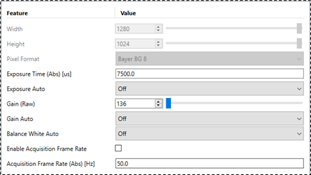

# Basler camera acquisition (ToF & RGB)
 
- [Camera configuration](#camera-configuration)
- [Basler SDK](#basler-sdk)

## Camera configuration
### ToF camera
| Model | S/N | MAC | Static IP | Mask | Gate |
| :---: | :---: | :---: | :---: | :---: | :---: |
| [blaze-101-GEV](https://docs.baslerweb.com/blaze-101?_gl=1*3x5v93*_gcl_au*MTE4MTUyODIwOS4xNzYwOTM5NTEx*_ga*NjQ3Njg1OTE3LjE3NjA5Mzk1MTE.*_ga_5KSFYEQ7CY*czE3NjEwOTAzODAkbzQkZzEkdDE3NjEwOTAzOTckajQzJGwwJGgw#hardware-requirements) | 24945819 | 00:30:53:3D:2D:25 | 192.168.50.31 | 255.255.255.0 | 0.0.0.0 |

### RGB camera
| Model | S/N | MAC | Static IP | Mask | Gate |
| :---: | :---: | :---: | :---: | :---: | :---: |
| [acA1300-75gc](https://docs.baslerweb.com/aca1300-75gc) | 24747625 | 00:30:53:48:71:69 | 192.168.50.30 | 255.255.255.0 | 0.0.0.0 |
- Pylon Viewer configuration (Features-Basic)  
  

## Basler SDK:
### [The pylon Software Suite](https://www.baslerweb.com/en/software/pylon-software-suite/)
- Version : [Basler pylon 8.0.2](https://www.baslerweb.com/zh-tw/downloads/software/1378313866/?downloadCategory.values.label.data=pylon+Supplementary+Package&downloadCategory.values.label.data=pylon)
- Including software :

  | pylon Viewer | pylon IP Configurator |
  | :--: | :--: |
  | Camera view for 2D camera | Configurate the camera IP | 

### blaze Viewer
Specially of blaze series camera (3D camera)
- Version : [pylon Supplementary Package for ToF Camera/blaze 1.7.1](https://www.baslerweb.com/zh-tw/downloads/software/2633371261/?downloadCategory.values.label.data=pylon+Supplementary+Package)
- Configuration : 
  - Set User level to Guru (highest permission)
  - In the left panel (parameter adjustment): adjust maximum depth, minimum depth

### Basler Pylon API
- Basler's Python package(Python API) **pypylon** is essntially a wrapper around the original Python C++ API, C# API.
- [pypylon github](https://github.com/basler/pypylon/tree/master)
- [Basler Pylon API document](https://zh.docs.baslerweb.com/pylonapi/index)
- Sample code :  
  - `C:\Program Files\Basler\pylon 8\Development\Samples\blaze\Python\pypylon`
  - [Device Enumeration and Device Configuration](https://github.com/basler/pypylon-samples/blob/main/notebooks/basic-examples/deviceenumeration_and_configuration.ipynb)
  - [Multi-camera handling](https://github.com/basler/pypylon-samples/blob/main/notebooks/basic-examples/multicamera_handling.ipynb)
  - [Grab Strategies](https://github.com/basler/pypylon-samples/blob/main/notebooks/basic-examples/grabstrategies.ipynb)
