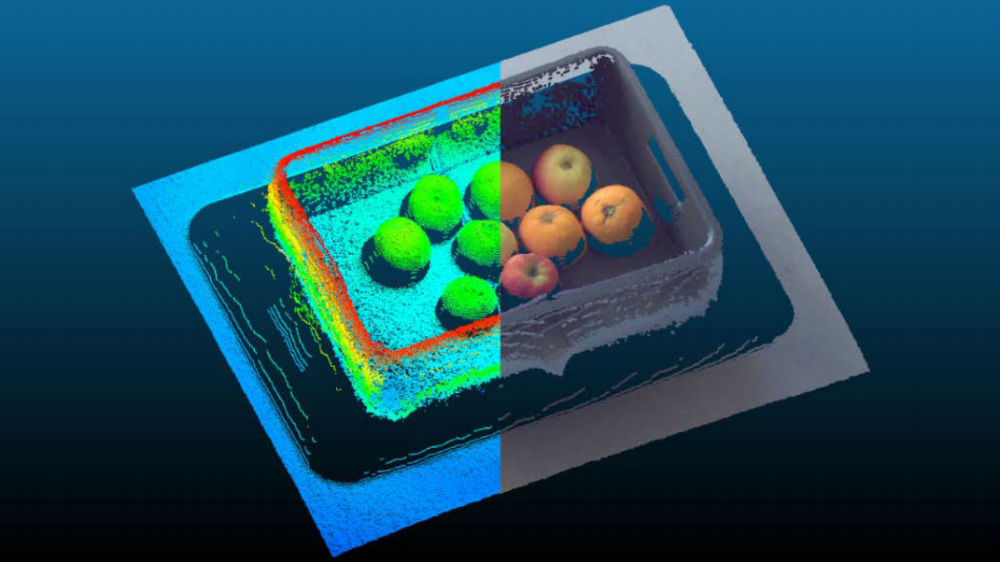
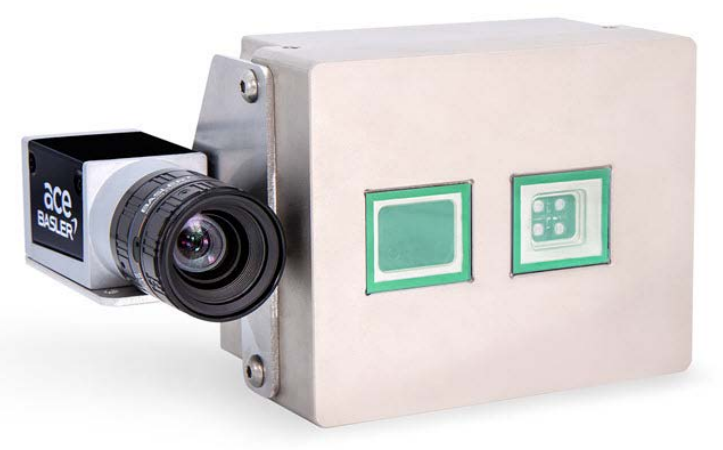

# Basler camera (RGB & ToF) data fusion
[Merging Color Data of Basler 2D Cameras with Basler blaze Depth Data](https://www.baslerweb.com/zh-tw/cameras/basler-tof-camera/rgb-d-solution/)

## Introduction
### Point Cloud of the Basler blaze Colorized Using the Basler 2D Camera RGB Color Data

- The **pylon Supplementary Package** for blaze contains **sample programs** that demonstrate how to 
calibrate the joint camera system.

## Sample System Setup
### Requirements
  - Basler blaze-101
  - Basler acA1300-75gc
  - Basler Lens C125-0418-5M-P f4mm
  - Mounting Bracket Bundle
### Assembled Sample Camera System


## Software Installation
- pylon Camera Software Suite
- pylon Supplementary Package for blaze

## Sample scripts
- Sample scripts for calibration and data fusion written in Python.
- Path: `./basler_src/`
### Python package
```commandline
pip install harvesters
conda install conda-forge::open3d
```
### calibration.py
The calibration of a system consisting of a Basler GigE color camera and a Basler blaze camera.
### fusion.py
The fusion script **uses the calibration information** amd the color camera data to display a colored point cloud.
