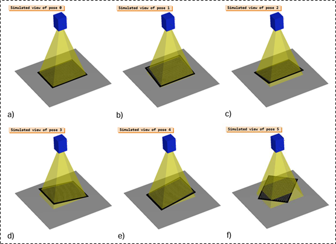
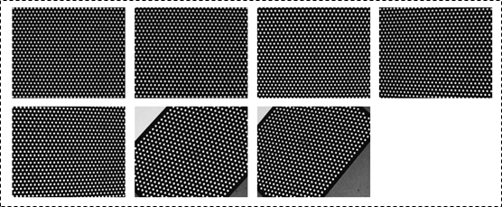

 # HALCON Eye-in-Hand Calibration

## HALCON
### HALCON file format
#### .hodj file
A binary object storage format exclusive to HALCON software, used to **store any HALCON object**, such as image, region, or 3D model.

#### .dat file
A .dat file in HALCON is a generic data container used to store various types of structed information, most commonly **camera parameter or pose and transformation matrices**.

#### .cpd file
- A .cpd file in HALCON defines the geometry and layout of the **calibration pattern**, including the number of rows and columns, point spacing, and point order.
- It is used during calibration to detect the pattern’s reference points in image.

#### .cal file
- A .cal file in HALCON is used to store the complete result of a camera calibration process.
- It contains:
  - Camera intrinsic parameters (focal length, principal point, distortion coefficients)
  - Camera extrinsic parameters (pose of the camera relative to the calibration object)
  - Calibration plate data
  - 2D-3D point correspondences for all calibration images

### HALCON sample code
HALCON HDevelop : `File > Browse HDevelop Example Programs > (Category) Application area > Robot vision > hand_eye_movingcam_calibration.hdev`

## Acquiring calibration images
*Notice : Eye-in-Hand calibration, do not move the calibration plate*  

## Camera intrinsic calibration
- Open file : 
  - For RGB Camera : `.\src\RGB_cam_intrinsic_calibration.hdev`
  - For ToF Camera : `.\src\ToF_cam_intrinsic_calibration.hdev`
- HDevelop item : **Assistants > Open New Calibration**
### Setup
- Calibration Task: *Full Calibration*
- Calibration Plate: 
    - Description File: `.\src\calibration_plate_description\calplateHG0608_2.cpd`
    - Thickness: *10 mm*
- Camera Parameters:
    - Camera Model: 
      - *Area Scan (Polynomial),* **do not** `Import Parametes …`
      - Don't check `Tilt`
    - Projection Model : *Projective*

### Calibration
- Image Source: Image Files
- Calibration: `Load` the image files from your device and `Calibration`, then the calibration result will display.
  - Image files: `.\src\calibration_img\`

### Results
- Calibration Status:
    - Status : Show the calibration status
    - Mean Error : The average reprojection error (Unit: pixel). The smaller, the better. Typically, a value below 0.5 is considered very good.
- Camera Parameters : The camera intrinsic parameters, saved as a .cal file. **(Need to convert it into a .dat file in order to use it for hand-eye calibration)**
- Camera Pose: The relative pose between the camera and the calibration plate, saved as a .dat file.

### Code Generation
- Calibration:
    - Generation Mode: Select `Calibration Data (Tuple)`, and `Insert Code`, then use the HALCON function : `write_cam_par` to convert tuple to .dat file for hand-eye calibration using.
- Output file : 
  - For RGB Camera : `.\src\calibration_result\RGB_cam_intrinsic_cal_SN24747625.dat`
  - For ToF Camera : `.\src\calibration_result\ToF_cam_intrinsic_cal_SN24945819.dat`

## Hand-eye calibration
Hand-eye calibration aims to find the precise position and orientation of a camera relative to the robot’s end-effector or base.
### Eye-in-hand vs. Eye-to-hand
- **Eye-in-hand** : calibration involves a camera mounted on the robot’s end-effector.
- **Eye-to-hand** : calibration involves a stationary camera that observes the robot’s workspace.

### Eye-in-hand calibration
- Collect the camera's images and TM-robot's flange position data : 
  - For RGB Camera : `.\src\collect_hand_eye_cal_data_for_rgb.py`
  - For ToF Camera : `.\src\collect_hand_eye_cal_data_for_tof.py`
#### Calibration step
- Open file: `.\src\hand_in_eye_calibration.hdev`
- Configurate the **Configuration Section** part
- Run the program, it will create : 
  - For RGB Camera : `.\src\calibration_result\flange_in_RGB_cam_SN24747625.dat`
  - For ToF Camera : `.\src\calibration_result\flange_in_ToF_cam_SN24945819.dat`

