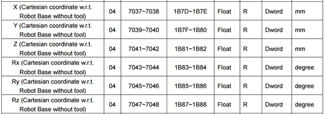

# TM robot Modbus communication

- [Modbus communication protocal](#modbus-communication-protocal)
- [TM robot (TMflow) Modbus configuration](#tm-robot-tmflow-modbus-configuration)
- [TM robot (TMflow) Modbus lists](#tm-robot-tmflow-modbus-lists)
- [Modbus Python API](#modbus-python-api)

## Modbus communication protocal
Modbus communication follows a **master-slave** model where the master sends a request and the slave responds with the corresponding data or status.  
- Architecture :  
  
  
- Common Modbus **Data types** :
  | Type | Data width | Usage |
  | :--: | :--: | :--: |
  | Coil | 1 bit | Switches, Status flags |
  | Register | 16 bit | Position, Numeric value |
  | Float | 32 bit | Composed of two registers |

## TM robot (TMflow) Modbus configuration
### TM5-900 IP Configuration
- 系統 > 網路 > Ethernet 11 (ASIX AX 88179 USB 3.0 to Gigabit Ethernet Adapter #5)

| Static IP | Mask | Port |
| :--: | :--: | :--: |
| 192.168.50.38 | 255.255.255.0 | 502 |

### TM5x-700 IP Configuration
- 系統 > 網路 > Ethernet 12 (ASIX AX 88179 USB 3.0 to Gigabit Ethernet Adapter #5)

| Static IP | Mask | Port |
| :--: | :--: | :--: |
| 192.168.50.49 | 255.255.255.0 | 502 |

### Enable Modbus TCP Server
- 設定 > Connection > Modbus Slave > 啟用
- 可以看 STATUS 來查看目前的狀態

## TM robot (TMflow) Modbus lists
### Modbus Classify

### Modbus Address
- Cartesian coordinate  
  
- Joint  
  

## Modbus Python API
- Python API : [pymodbus](https://pypi.org/project/pymodbus/)
- [Example code](https://pymodbus.readthedocs.io/en/latest/source/examples.html)

  
